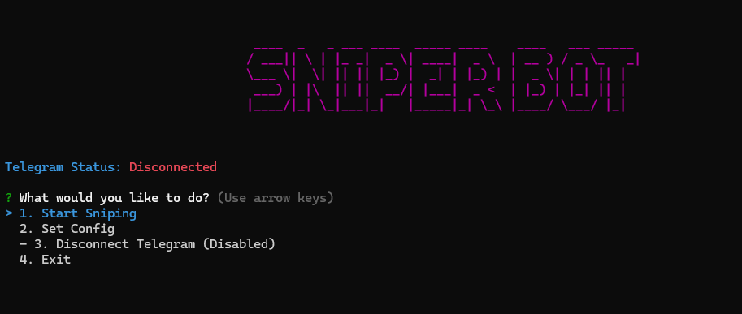
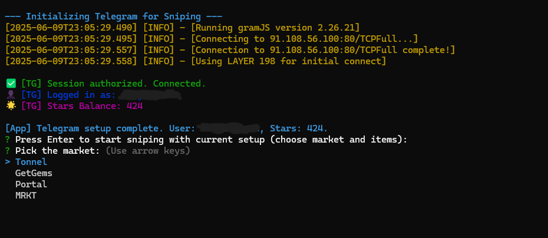
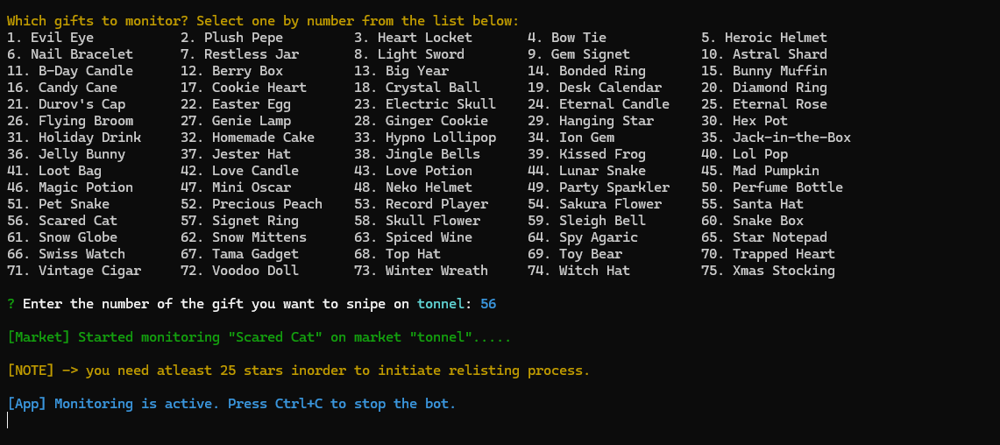

[![Contributors][contributors-shield]][contributors-url]
[![Forks][forks-shield]][forks-url]
[![Stargazers][stars-shield]][stars-url]
[![Issues][issues-shield]][issues-url]

<br />
<div align="center">
  <a href="https://github.com/vamp30/telegram-gift-sniper">
    
  </a>

  <h3 align="center">telegram-gift-sniper</h3>

  <p align="center">
     Buys the cheapest available gift in your chosen market and instantly relists it for a higher price, all through a Terminal User Interface (TUI).
    <br />
    <a href="https://github.com/vamp30/telegram-gift-sniper"><strong>Explore the docs »</strong></a>
    <br />
    <br />
    <a href="https://github.com/vamp30/telegram-gift-sniper">View Demo</a>
    ·
    <a href="https://github.com/vamp30/telegram-gift-sniper/issues">Report Bug</a>
    ·
    <a href="https://github.com/vamp30/telegram-gift-sniper/issues">Request Feature</a>
  </p>
</div>
# telegram-gift-sniper

Efficiently snipe gifts on Telegram markets and relist them for profit, featuring an interactive command-line interface for easy operation.

<div align="center">
  <p><strong>✨ TUI in Action ✨</strong></p>
  
  
  <p><small><em>Main TUI showing operational status and options.</em></small></p>
  <br/>
  
  
  <p><small><em>Navigating through the configuration menus.</em></small></p>
  <br/>
  
  
  <p><small><em>Viewing detailed logs or process information.</em></small></p>
</div>

## Installation Instructions


### Auto Installation and Setup (Easier)

1.  Download the repository or clone using:
    ```sh
    git clone https://github.com/vamp30/telegram-gift-sniper.git
    ```
2.  Ensure you have [Node.js](https://nodejs.org/) (version 18+ recommended) installed.
3.  Run the `setup.bat` file (for Windows).
    *   This will install all necessary project dependencies using npm.
    *(Note: For non-Windows users, simply run `npm install` in the terminal after cloning.)*


### Manual Configuration

1.  Open your terminal.
2.  Clone the repository:
    ```sh
    git clone https://github.com/vamp30/telegram-gift-sniper.git
    ```
    *or download the ZIP and extract it.*
3.  Navigate to the project directory:
    ```sh
    cd telegram-gift-sniper
    ```
4.  Install dependencies:
    ```sh
    npm install
    ```
5.  Run the script:
    ```sh
    node index.js
    ```

## Specifications

1.  **Market Selection:** Choose from multiple supported Telegram gift markets (e.g., Tonnel, GetGems, Portal, MRKT).
2.  **Gift Selection:** Interactively select specific Telegram gifts to monitor and snipe from a predefined list.
3.  **Automated Sniping & Purchase:** Scans chosen markets for the cheapest listings of selected gifts and attempts to purchase them automatically.
4.  **Instant Relisting:** Automatically relists purchased gifts on the market, aiming for a profitable resale price.
5.  **Telegram API Integration:** Securely connects to Telegram using your API credentials for account operations and session management.
6.  **Interactive TUI:** A user-friendly Terminal User Interface (TUI) for easy configuration, market/gift selection, and operational monitoring.
7.  **Runtime Configuration:** Prompts for and manages essential settings such as Telegram API ID, API Hash, and spending thresholds.
8.  **Spending Controls:** Define minimum and maximum amounts (e.g., TON or Stars, depending on market requirements) for purchasing gifts.


[contributors-shield]: https://img.shields.io/github/contributors/sinrazed/telegram-gift-sniper.svg?style=for-the-badge
[contributors-url]: https://github.com/vamp30/telegram-gift-sniper/graphs/contributors
[forks-shield]: https://img.shields.io/github/forks/sinrazed/telegram-gift-sniper.svg?style=for-the-badge
[forks-url]: https://github.com/vamp30/telegram-gift-sniper/network/members
[stars-shield]: https://img.shields.io/github/stars/sinrazed/telegram-gift-sniper.svg?style=for-the-badge
[stars-url]: https://github.com/vamp30/telegram-gift-sniper/stargazers
[issues-shield]: https://img.shields.io/github/issues/sinrazed/telegram-gift-sniper.svg?style=for-the-badge
[issues-url]: https://github.com/vamp30/telegram-gift-sniper/issues
